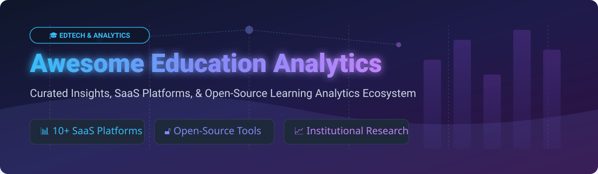

# Awesome-Education-Analytics 🎓

  

> 🚀 **Curated List of SaaS Products & Open-Source GitHub Projects for Education Analytics, Learning Analytics, Student Success Platforms & Institutional Effectiveness.**

---

## 📌 Overview

This repository tracks top-tier **SaaS platforms** and **open-source projects** for **Education Analytics** 📊. These tools empower K-12 school districts, colleges, universities, and EdTech developers to convert student data into actionable insights—identifying at-risk learners 🚨, evaluating intervention outcomes 📈, and backing data-informed instruction.

---

## 🌐 Market Overview & Dynamics

> 💡 **Market Size & Fragmenting Dynamic:**  
> The Global Education Analytics Market size was estimated at **~$3.8 Billion in 2024** and is projected to reach **~$12.5 Billion by 2032**, expanding at a CAGR of **~16.1%**.  
> The sector is **moderately fragmented**: while large EdTech conglomerates (e.g., PowerSchool, Instructure, Renaissance) acquire niche category leaders to build end-to-end suites, specialized platforms and open-source ecosystems thrive due to diverse institutional data governance, regional compliance rules (FERPA/GDPR), and custom SIS/LMS integration requirements.

---

## 📑 Table of Contents

- [🌐 Market Overview & Dynamics](#-market-overview--dynamics)
- [💼 SaaS/Hosted Platforms](#-saashosted-platforms)
- [🔓 Open-Source GitHub Projects](#-open-source-github-projects)
- [🤝 How to Contribute](#-how-to-contribute)
- [⚠️ Disclaimer](#️-disclaimer)
- [💖 Support & Sponsorship](#-support--sponsorship)
- [📈 Star History](#-star-history)

---

## 💼 SaaS/Hosted Platforms

The following table summarizes key commercial SaaS platforms for education and learning analytics, sorted descending by company size (valuation / annual revenue / market cap).

| Product 🛠️ | Description 📝 | Company Valuation / Revenue 💰 | Starting Paid Tier Pricing 💵 | Free Tier / Free Trial Limits ⏳ |
| :--- | :--- | :--- | :--- | :--- |
| **[Tableau for Education](https://www.tableau.com/)** | BI & data visualization standard for institutional research & higher-ed dashboards. | **~$15.7B** (Salesforce Acquisition Value) | **$15/user/month** (Viewer tier billed annually) | **1-Year Free License** for eligible students & instructors; 14-day free trial for desktop. |
| **[PowerSchool Unified Insights](https://www.powerschool.com/)** | K-12 longitudinal analytics platform with 60+ dashboards & early indicator warnings. | **~$5.6B** (Onex Buyout / Private Equity) | **$5.40/student/year** (Starting district module license) | **No Free Tier**; 30-day guided interactive demo available for district admins. |
| **[LearnPlatform by Instructure](https://www.instructure.com/)** | EdTech effectiveness & usage analytics platform evaluating edtech ROI & compliance. | **~$4.8B** (KKR Acquisition / Instructure Market Cap) | **$2,500/year** (Starting tier per district) | **Free Starter Tier** for individual educators/schools (up to 100 edtech product evaluations). |
| **[D2L Performance+](https://www.d2l.com/)** | Predictive learning analytics add-on for Brightspace LMS tracking student risk levels. | **~$450M** (Public Market Cap) | **$3.50/user/year** (LMS add-on module starting price) | **30-Day Free Trial** of Brightspace LMS environment with basic analytics enabled. |
| **[Civitas Learning](https://www.civitaslearning.com/)** | Higher-ed predictive analytics platform focusing on student retention & degree completion. | **~$250M** (Estimated Enterprise Valuation) | **$15,000/year** (Institutional base tier subscription) | **No Free Tier**; customized institution live sandbox demo available upon request. |
| **[SchoolStatus](https://www.schoolstatus.com/)** | K-12 MTSS & attendance analytics platform predicting chronic absenteeism. | **~$200M** (Estimated Private Valuation) | **$3,000/school/year** (Starting K-12 school package) | **No Free Tier**; 14-day full platform demo for school administrators. |
| **[Schoolzilla](https://schoolzilla.com/)** | Multi-measure K-12 data warehouse dashboard (Renaissance Learning). | **~$150M** (Segment Acquisition Valuation) | **$2.50/student/year** (District subscription model) | **No Free Tier**; 30-day district sample data trial available. |
| **[Watermark Insights](https://www.watermarkinsights.com/)** | Higher-ed Leader Insights dashboard tracking course persistence & institutional effectiveness. | **~$120M** (Estimated Valuation) | **$5,000/year** (Base institutional license) | **No Free Tier**; customized live product walkthrough upon request. |
| **[Otus](https://otus.com/)** | K-12 assessment, grading, & student progress monitoring platform. | **~$45M** (Estimated Valuation / Funding) | **$5.00/student/year** (K-12 district licensing) | **30-Day Free Trial** for single teachers with up to 30 active student profiles. |
| **[BrightBytes](https://www.brightbytes.net/)** | EdTech usage analytics platform collecting app usage data via Chrome Agent. | **~$35M** (Estimated Enterprise Valuation) | **$1,800/district/year** (Base analytics suite) | **No Free Tier**; 30-day trial for district IT administrators. |

---

## 🔓 Open-Source GitHub Projects

Below are top open-source projects, frameworks, and data platforms for building self-hosted education analytics dashboards. Sorted descending by GitHub Stars_Count ⭐.

- **[Apache Superset](https://github.com/apache/superset)**  🌟  
  *Modern open-source enterprise data exploration & visualization platform used to connect SIS, LMS, and assessment databases into interactive education analytics dashboards.*

- **[Metabase](https://github.com/metabase/metabase)**  🌟  
  *No-SQL-required business intelligence tool allowing educators and institutional researchers to query and graph student progress data in minutes.*

- **[Apache Airflow](https://github.com/apache/airflow)**  🌟  
  *Programmatic workflow orchestration platform ideal for ETL/ELT data pipelines pulling data from LMS APIs, SIS tables, and attendance logs.*

- **[Grafana](https://github.com/grafana/grafana)**  🌟  
  *Operational dashboard platform used by education IT infrastructure teams to monitor real-time LMS uptime, student portal load times, and digital learning activity.*

- **[dbt-core](https://github.com/dbt-labs/dbt-core)**  🌟  
  *Data transformation tool that enables data engineers to model raw student assessment and attendance datasets inside PostgreSQL/Snowflake data warehouses.*

- **[Plotly Python](https://github.com/plotly/plotly.py)**  🌟  
  *Interactive graphing library for Python used by educational researchers for statistical analysis, grade distribution heatmaps, and retention modeling.*

- **[Canvas LMS](https://github.com/instructure/canvas-lms)**  🌟  
  *Open-core learning management system providing raw access to Live Events, Canvas Data 2, and learning analytics APIs.*

- **[Moodle](https://github.com/moodle/moodle)**  🌟  
  *World-renowned open-source LMS featuring built-in Learning Analytics API, student engagement prediction models, and custom reports.*

- **[Student Performance Dashboard (hcoco1)](https://github.com/hcoco1/hcoco1-dashboard)**  🌟  
  *Interactive Dash/Plotly Python dashboard designed specifically for visualizing high school grade trends, subject averages, and longitudinal exam scores.*

- **[OpenEMIS Core](https://github.com/OpenEMIS/core)**  🌟  
  *Comprehensive open-source Education Management Information System for managing system-wide student attendance, academic progress, and institutional data.*

---

## 🤝 How to Contribute

Contributions are warmly welcomed! Help us keep this list comprehensive and up to date:

1. 🍴 **Fork** this repository.
2. 📝 **Add/Update** entries in `README.md` following the tabular or starred format.
3. 📌 **Include** verified details: platform name, URL, exact pricing tier/limits, Stars_Badges, and factual descriptions.
4. 🚀 **Submit** a Pull Request with a clear summary of your changes.

---

## ⚠️ Disclaimer

- This is a **community-curated** educational catalog — not an endorsement of any vendor or software.
- Education analytics platforms store and process sensitive student PII; always enforce strict compliance with **FERPA, COPPA, GDPR**, and local privacy regulations.
- Self-hosted open-source software requires proper database security hardening, access controls, and active data governance.

---

## 💖 Support & Sponsorship

If you find this repository helpful for your institutional research, EdTech projects, or learning analytics stack, please consider supporting the project!

- ⭐ **Star** this repository to increase visibility.
- 🔀 **Fork & Share** with fellow education data engineers, district admins, and researchers.
- ☕ **Sponsor**: Buy me a coffee via [GitHub Sponsors](https://github.com/sponsors/ishandutta2007) to help maintain awesome open-source resources!

---

## 📈 Star History

---

  <b>Made with ❤️ for educators, institutional researchers, district administrators, and education data teams.</b>

